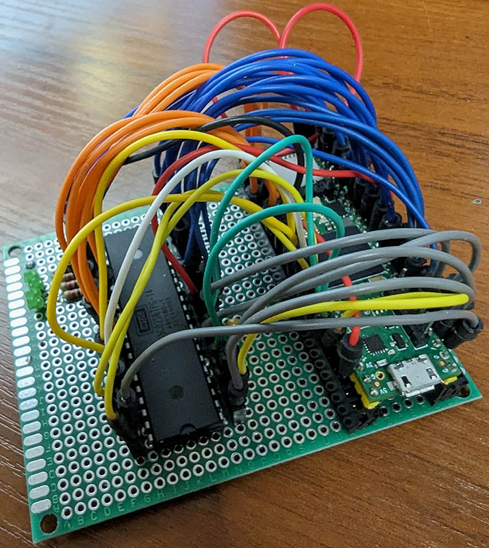

# W65C02-COM bridge for Teensy 4.1

This project is a simple bridge between [W65C02 CPU](https://westerndesigncenter.com/wdc/documentation/w65c02s.pdf)
and a COM port, implemented for [Teensy 4.1 development board](https://www.pjrc.com/store/teensy41.html).

The main purpose for this project is to provide cycle-by-cycle debugging capabilities of W65C02, but it can serve
other purpose too, i.e.:

- __Comparative debugging for emulators__:
  You can run your 6502-family emulator in parallel with an actual CPU to compare the results
  in order to measure the accuracy of an emulator.
- __Emulated 8-bit computers with a physical processor__:
  You can implement an emulator of an 8-bit, 6502-based computer (i.e. C64), that will work
  (via this bridge) with a real CPU, while other components of the system (like RAM, ROM,
  video chip) remain emulated.

## Connection

The CPU is a 40-pin chip, with 37 data pins (2 pins are for
power/ground and pin 35 is unused). As Teensy board is equipped with 38 digital input/output pins,
it seems to be a perfect match for this project.

Below there is a pinout diagram of the W65C02 CPU

```text
            +------------+
    VP/ <-- |  1      40 | <-- RES/
    RDY <-> |  2      39 | --> PHI2O
  PHI1O <-- |  3      38 | <-- SO/
   IRQ/ --> |  4      37 | <-- PHI2
    ML/ <-- |  5     @36 | <-- BE
   NMI/ --> |  6      35 | --- NC
   SYNC <-- |  7     *34 | --> RW/
    VDD --> |  8     *33 | <-> D0
     A0 <-- |  9*    *32 | <-> D1
     A1 <-- | 10*    *31 | <-> D2
     A2 <-- | 11*    *30 | <-> D3
     A3 <-- | 12*    *29 | <-> D4
     A4 <-- | 13*    *28 | <-> D5
     A5 <-- | 14*    *27 | <-> D6
     A6 <-- | 15*    *26 | <-> D7
     A7 <-- | 16*    *25 | --> A15
     A8 <-- | 17*    *24 | --> A14
     A9 <-- | 18*    *23 | --> A13
    A10 <-- | 19*    *22 | --> A12
    A11 <-- | 20*     21 | --> GND
            +------------+

    * - tri-state pin,   @ - async,  / - active on low
```

### Minimal configuration

In the minimalistic configuration the following pins must be connected with the board:

- `A0-A15` - address bus (input)
- `D0-D7` - data bus (input or output; input by default)
- `RW` - read/write input; it informs whether the data bus is in read (high) or write (low) state
- `PHI2` - clock signal input
- `GND` - ground, should be connected with Teensy's ground pin
- `VDD` - power; should be connected with Teensy's 3.3V pin

In such configuration `RES`, `IRQ`, `NMI` and `BE` pins must be also connected to 3.3V
and `RDY` pin should be connected with power via resistor.

### Default configuration

The table below illustrates the default configuration of this project.
In order to adjust the pin mapping, modify `PINS_MAP` macro definition in the
[configuration file](./configuration.h).

| Teensy pin | CPU pin | CPU pin name | ←  → | CPU Pin name  | CPU pin | Teensy pin |
| ---------- | ------- | ------------ | ---- | ------------- | ------- | ---------- |
|            | 1       | Vector pull  |      | Reset         | 40      |            |
|            | 2       | Ready        |      | PHI2O         | 39      |            |
|            | 3       | PHI1O        |      | Set overflow  | 38      |            |
|            | 4       | IRQ          |      | PHI2          | 37      | 23         |
|            | 5       | Memory lock  |      | Bus enable    | 36      |            |
|            | 6       | NMI          |      | No connection | 35      |            |
|            | 7       | SYNC         |      | Read/Write    | 34      | 21         |
| 3.3V       | 8       | Power        |      | D0            | 33      | 20         |
| 10         | 9       | A0           |      | D1            | 32      | 19         |
| 11         | 10      | A1           |      | D2            | 31      | 18         |
| 12         | 11      | A2           |      | D3            | 30      | 17         |
| 24         | 12      | A3           |      | D4            | 29      | 16         |
| 25         | 13      | A4           |      | D5            | 28      | 15         |
| 26         | 14      | A5           |      | D6            | 27      | 14         |
| 27         | 15      | A6           |      | D7            | 26      | 13         |
| 28         | 16      | A7           |      | A15           | 25      | 36         |
| 29         | 17      | A8           |      | A14           | 24      | 35         |
| 30         | 18      | A9           |      | A13           | 23      | 34         |
| 31         | 19      | A10          |      | A12           | 22      | 33         |
| 32         | 20      | A11          |      | Ground        | 21      | Ground     |

### Example

The photo demonstrate the minimalistic configuration described above (address and data buses only,
pluc clock and read/write signal). Additionally, `PHI1O` and `PHI2O` pins are connected to LEDs on
the breadboard for monitoring clock cycles. Finally, there is a button for manually controlling
reset function of the CPU.

### Warning

Incorrect connection may destroy the CPU. Please take extra attention to the
correctness of your wiring, and double-check it before powering up your board.

## Compilation and execution

### With Arduino IDE and Teensyduino

1. Install [Arduino IDE](https://www.arduino.cc/en/software)
1. Install and configure [Teensyduino](https://www.pjrc.com/teensy/teensyduino.html)
1. Clone this project into your Arduino sketches folder (usually `~/Arduino/sketches`)
1. Click menu `Sketch / Compile` to compile
1. Click menu `Sketch / Upload` tu upload to Teensy board

### With Arduino CLI...

#### ...and NIX packages

If you are not using Nix packages, then you don't know how much you miss
in terms of convenience and reproducible dev environemnts -
[start](https://nixos.org/download) today :-)

There are no prerequisites. The only thing required is working Nix environment.

1. Clone the repo and cd project's directory
1. If you use [direnv](https://direnv.net/), just execute `direnv allow`, otherwise type `nix-shell`
1. Wait until all dependencies will be downloaded and configured
1. To compile, type:
1. To upload:
1. To format your code changes: `treefmt`

#### Without NIX

TBD

## Working with other CPUs from the 6502-family

This project is meant to work specifically with W65C02 CPU. The main reason
is that W65C02 is static, that means it can be easily step-by-step cycled at any speed,
that is very useful in case of debugging. Some other CPUs, like C64's MOS6510, have
limitations of a minimum speed (~100kHz). This bridge would still work with these CPUs
(after some adjustments - see below), but more in a "runtime" mode, rather than for debugging.

Perhaps a good workflow could be to test/debug your project with W65C02 and then
switch to your desired CPU.

Please note that other processors from the 6502-family have different pin layout,
so this code needs to be adjusted in order to make them work.
